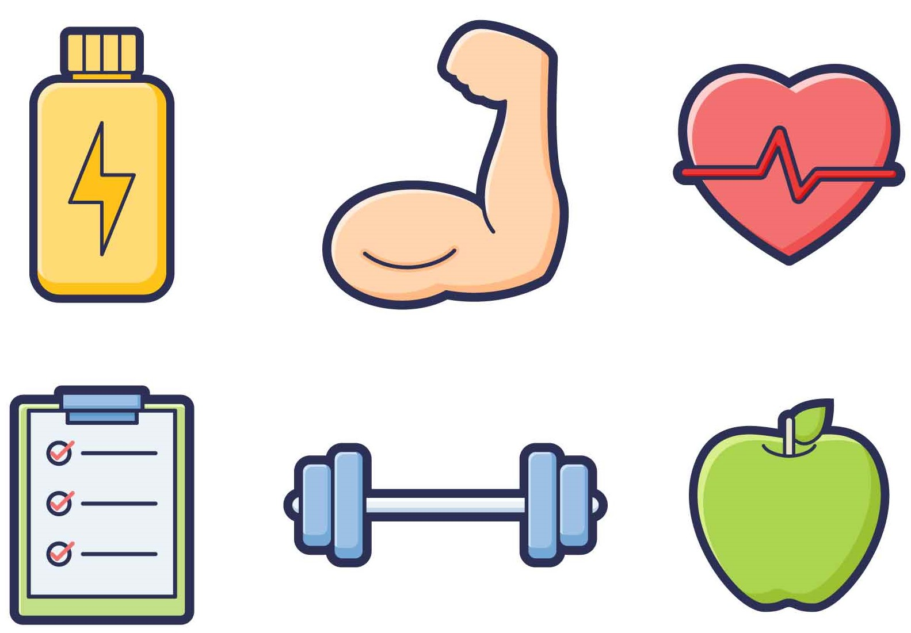

<header>
    

      <nav class="navbar navbar-expand-lg fixed-top navbar-transparent bg-primary" color-on-scroll="400">
        

          

            <button class="navbar-toggler navbar-toggler" type="button" data-toggle="collapse" data-target="#navigation"
              aria-controls="navigation" aria-expanded="false" aria-label="Toggle navigation"></button>
          

          

            <ul class="navbar-nav">
              <li class="nav-item"><a class="nav-link smooth-scroll" href="#about">Über Mich</a></li>
              <li class="nav-item"><a class="nav-link smooth-scroll" href="#education">Ausbildung</a></li>
              <li class="nav-item"><a class="nav-link smooth-scroll" href="#skill">Skills</a></li>
              <li class="nav-item"><a class="nav-link smooth-scroll" href="#experience">Nebenjobs</a></li>
              <li class="nav-item"><a class="nav-link smooth-scroll" href="#voluntary">Ehrenamt</a></li>
              <li class="nav-item"><a class="nav-link smooth-scroll" href="#hobbies">Hobbies</a></li>
              <li class="nav-item"><a class="nav-link smooth-scroll" href="#contact">Kontakt</a></li>
              <!--  TODO: Seite übersetzen
              <li>
                

                  

                    
                  
            
                

              </li>
              -->
            </ul>
          

        

      </nav>
    

  </header>
  

    

      

        

          

            

            

            

              

                

                
Niyousha Homay Nikfar

                
Biomedizintechnikerin

                  <a class="btn btn-primary" href="/download/lebenslauf.pdf" data-aos="zoom-in" data-aos-anchor="data-aos-anchor" target="_blank">Lebenslauf herunterladen</a>
              

            

          

        

      

      

        

          

            

              

                

                  
Über mich

                  
Hallo! Ich bin Niyousha Homay Nikfar. Angehende Medizintechnische Ingenieurin und Entwicklerin.

                  
Ich hatte immer den Traum mich dafür einzusetzen der Welt etwas wertvolles zu geben. Etwas, das den Menschen hilft, ihre Lebensqualität erhöht und ihnen mehr Kraft und Gesundheit gibt, damit Sie mehr Zeit haben ihre eigenen Träume und Ziele zu verfolgen. Deshalb habe ich mich für das Studium der Biomedizintechnik entschieden. Dabei bringe ich meine Kreativität und meine lebensfrohe Art in mein Studium und meine Arbeit ein. Ich bin engagiert, bereit Risiken einzugehen und jemand, dem man seine Aufgaben gerne anvertraut. Bleiben Sie eine Weile und machen Sie sich ein Bild von mir. Willkommen auf meiner Internetseite! &#128519;

                

              

            

          

        

      

      

        

          
Ausbildung

          

            

              

                

                  
2018 - Heute

                  
BACHELOR

                

              

              

                

                  
Bachelor of Science in Biomedizintechnik

                  
Fachhochschule Dortmund

                  
Ich habe mich für das Studium an der Fachhochschule Dortmund entschieden, weil dort die Anwendung des Gelernten praktiziert wird. Sichere Kenntnisse habe ich in der Software- und Hardwareprogrammierung für medizinische Systeme und Geräte erworben. Zu den weiteren Schwerpunkten meines Studiums gehören Bildgebende Verfahren der Medizintechnik, Signalverarbeitung und Messtechnik, Elektrophysiologische Messungen, Lehren über das Kardiovaskuläre System und die Kalibrierung von Sensordaten. 

                

              

            

          

          

            

              

                

                  
2017 - 2018

                  
BACHELOR

                

              

              

                

                  
Bachelor of Science in Elektrotechnik

                  
Universität Duisburg-Essen

                  <!-- Ich hatte den großen Wunsch, in Deutschland an meine Kompetenzen und Interessen an den Inhalten aus meinem Studium der Strahlenmedizintechnik anzuknüpfen. Die Möglichkeit, mein Wunschstudium zu beginnen, hatte ich nicht auf Anhieb. Ich wollte jedoch auch gerne im Thema bleiben und meinem Ziel näherkommen. Dieses Studium diente folglich in erster Linie der Studienvorbereitung. Ich nutzte dort meine Zeit, um mich auf mein Wissen in den Bereichen der Elektrotechnik und technischen Informatik auszubauen, welche Bestandteil meines jetzigen Studiums sind.  -->
                  
Dieses Studium diente in erster Linie der Studienvorbereitung auf meinem Wunschstudium Medizintechnik. Ich nutzte dort meine Zeit, um mich auf mein Wissen in den Bereichen der Elektrotechnik und technischen Informatik auszubauen, welche Bestandteil meines jetzigen Studiums sind.

                

              

            

          

          

            

              

                

                  
2014 - 2016

                  
OBERMATURA

                

              

              

                

                  
Studium der Strahlenmedizintechnik

                  
Universität Azad Lahijan, Iran

                  
Nach meinem Abitur habe ich das Studium der Strahlenmedizintechnik aufgenommen. Hier habe ich erste Einblicke in die Welt der medizinischen Technik bekommen. Schwerpunkte dort waren medizinische Grundlagen, wie Physiologie, Anatomie, Biologie und Biochemie, sowie Nukleartechnologien und Werkstofflehre.

                

              

            

          

        

      
 
      

        

          
Skills

          

            

              

                

                  
MS(Excel/Word/Power Point)
                    

                      

90%
                    

                  

                

                

                  
MATLAB/Simulink
                    

                      

80%
                    

                  

                
               
              

              

                

                  
Java/SQL
                    

                      

50%
                    

                  

                

                 

                  
C/C++
                    

                      

40%
                    

                  

                

              

            

          

        

      

      

        

          
Nebenjobs

          

            

              

                

                  
03.21 - heute

                  
Kbv

                

              

              

                

                  
Kundenberaterin

                  
Zurzeit arbeite ich als Kundenberaterin bei der Kassenärztliche Bundesvereinigung. Hier bin ich insbesondere verantwortlich für die Beantwortung allgemeiner Fragen rund um den Prozess zur Corona-Impfung, Prüfung personenbezogener Daten, Vergeben von Terminen für Impfzentren und dem Versenden und Archivieren von Dokumenten.

                

              

            

          

          

            

              

                

                  
01.18 - 03.21

                  
Deutsche Post/Postbank

                

              

              

                

                  
Mitarbeiterin

                  
Kassiertätigkeiten und Inventuren, Kundenberatung und die gelegentlichen Vertretung der Filialleiterin, haben hier meinen Aufgabenbereich gebildet. Letzteres trug besonders dazu bei meine Fähigkeiten im Leiten von Teams auszubauen.

                

              

            

          

          

            

              

                

                  
07.20 - 01.21

                  
MedQN Bochum

                

              

              

                

                  
Praktikum

                  
Zu meinen Aufgaben beim medizinischen Qualitätsnetz gehörten das Innovationsmanagement und administrative Tätigkeiten, wie das Vereinbaren von Terminen, aber auch das Sammeln und Archivieren medizinischer Daten.

                

              

            

          

          

            

              

                

                  
10.14 - 05.15

                  
Pischraft Schule, Iran

                

              

              

                

                  
Aushilfe

                  
Während meines Studiums der Strahlenmedizintechnik habe ich erste Erfahrungen im Arbeitsalltag als Aushilfe im Büro sammeln können. Zu meinen Aufgaben dort gehörte das Organisieren der Schuldaten am Computer und Unterstützung bei der Vorbereitung der Prüfungen und Veranstaltungen.

                

              

            

          

        

      

      

        

          
Ehrenamt

          

            

              

                

                  
2019 - Heute

                  
Senat, Fachschaft

                

              

              

                

                  
Hochschulpolitik

                  
Neben meinem Studium an der Fachhochschule Dortmund interessiere ich mich auch für die dortige Hochschulpolitik und das Organisieren studentischer Projekte. Deshalb engagiere ich mich seit 2019 ehrenamtlich im Senat, in der Fachschaft meines Fachbereiches und dem Frauenprojektlabor der Fachhochschule Dortmund. 

                

              

            

          

        

      

      

        

          
Hobbies und Freizeit

          

            

              

                

                  
                

              

              

                

                  
Fachliteratur

                  
Und Sprüche auf Glückskeksen

                  
Nach einem anstrengenden Tag bin ich manchmal sehr froh darüber, den Tag mit einem Buch ausklingen zu lassen, egal ob gebunden, auf dem Handy oder vorgelesen. Besonders gefallen mir die Geschichten von erfolgreichen Menschen und die Psychologie dahinter. Ich fühle mich dadurch motivierter, mich zu verbessern und meine Träume zu verfolgen.

                

              

            

          

          

            

              

                

                  
                

              

              

                

                  
Fitness

                  
Sport ist Mord oder so

                  
Das Fitnessstudio ist wie ein Tempel für meinen Körper. Mir ist wichtig, einen Ausgleich zu schaffen, damit mein Kopf sich erholen und mein Geist Ruhe finden kann. Die Wasserbettmassage am Ende eines Trainings bestärkt meine Motivation erheblich. Es gibt kaum etwas Entspannenderes.

                

              

            

          

          

            

              

                

                  
                

              

              

                

                  
Musik

                  
Meine Nachbarn lieben mich

                  
Musik liebe ich schon seit meiner Kindheit. Ich singe sehr gerne und spiele nebenbei Gitarre. Von 2017 bis 2019 war ich Mitglied der X-Vision Band in der Musikschule Wattenscheid. Dort hatte ich die Gelegenheit mit internationalen Menschen zu musizieren und auf die Bühne zu gehen.

                

              

            

          

          

            

              

                

                  
                

              

              

                

                  
Poker

                  
Gewinnen ist nicht alles

                  
Erst bei einer Pokerrunde, bei der es um die Rechnung fürs Abendessen geht, lernt man sein gegenüber wirklich kennen. Für mich ist es ein sehr geselliges aber auch taktisches Spiel, bei dem man seine nächsten drei Schritte gut planen muss.

                

              

            

          

        

      
     
      

          

            

              

                

                  

                    
Kontakt

                    

                      

                        

                          <form action="https://formspree.io/f/mzbkevqn" method="POST">
                            
<strong>Gerne können Sie mich kontaktieren</strong>
                            

                            

                              

                                
<i
                                      class="fa fa-user-circle"></i>
                                  <input class="form-control" type="text" name="name" placeholder="Name"
                                    required="required" />
                                

                              

                            

                            

                              

                                
<i
                                      class="fa fa-file-text"></i>
                                  <input class="form-control" type="text" name="Subject" placeholder="Betreff"
                                    required="required" />
                                

                              

                            

                            

                              

                                
<i
                                      class="fa fa-envelope"></i>
                                  <input class="form-control" type="email" name="_replyto" placeholder="E-Mail"
                                    required="required" />
                                

                              

                            

                            

                              

                                

                                  <textarea class="form-control" name="message" placeholder="Deine Nachricht"
                                    required="required"></textarea>
                                

                              

                            

                            

                              

                                <button class="btn btn-info" type="submit">Senden</button>
                              

                            

                          </form>
                        

                      

                    

                  

                

              

            

          

      

    

  

  <footer class="footer">
    
  </footer>

  
  
  
  
  
  