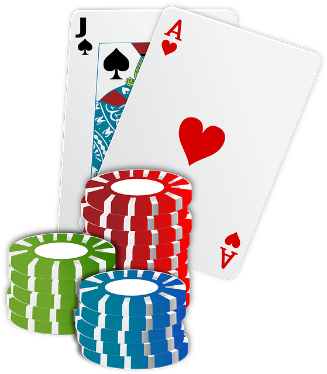

<header>
    

      <nav class="navbar navbar-expand-lg fixed-top navbar-transparent bg-primary" color-on-scroll="400">
        

          
<a class="navbar-brand" href="#" rel="tooltip">Niyoushas CV</a>
            <button class="navbar-toggler navbar-toggler" type="button" data-toggle="collapse" data-target="#navigation"
              aria-controls="navigation" aria-expanded="false" aria-label="Toggle navigation"></button>
          

          

            <ul class="navbar-nav">
              <li class="nav-item"><a class="nav-link smooth-scroll" href="#about">Über Mich</a></li>
              <li class="nav-item"><a class="nav-link smooth-scroll" href="#skill">Skills</a></li>
              <li class="nav-item"><a class="nav-link smooth-scroll" href="#education">Bildung</a></li>
              <li class="nav-item"><a class="nav-link smooth-scroll" href="#experience">Erfahrung</a></li>
              <li class="nav-item"><a class="nav-link smooth-scroll" href="#hobbies">Hobbies</a></li>
              <li class="nav-item"><a class="nav-link smooth-scroll" href="#contact">Kontakt</a></li>
              <li>
                

                  

                    
                  
            
                

              </li>
            </ul>
          

        

      </nav>
    

  </header>
  

    

      

        

          

            

            

            

              

                

                
Niyousha Homay Nikfar

                
Medizintechnikerin

                  <a class="btn btn-primary" href="/download/lebenslauf.pdf" data-aos="zoom-in" data-aos-anchor="data-aos-anchor" target="_blank">Download CV</a>
              

            

          

        

      

      

        

          

            

              

                

                  
Über mich

                  
Hallo! Ich bin Niyousha Homay Nikfar. Medizintechnische Ingenieurin und Entwicklerin.

                  
Mein Traum ist es nach meinem Studium etwas zu entwickeln, dass die Welt verändert. Ich möchte mein
                  Wissen dazu nutzen so vielen Menschen zu helfen wie ich nur kann. Ich bin engagiert, risikofreudig und verlässlich.
                  Bleib eine Weile und erschaffe dir dein Bild von mir. Willkommen auf meiner CV-Site!

                

              

              

                

                  
Allgemeine Informationen

                  

                    
<strong class="text-uppercase">Geboren am:</strong>

                    
11.03.1997

                  

                  

                    
<strong class="text-uppercase">Email:</strong>

                    
niyousha.nikfar@gmail.com

                  

                  

                    
<strong class="text-uppercase">Telefon:</strong>

                    
+49 176 34342760

                  

                  

                    
<strong class="text-uppercase">Adresse:</strong>

                    
Luisenstr. 9-13

                  

                  

                    
<strong class="text-uppercase">Sprache:</strong>

                    
Deutsch, Englisch, Persisch

                  

                

              

            

          

        

      

      

        

          
Skills

          

            

              

                

                  
MS(Excel/Word/Power Point)
                    

                      

90%
                    

                  

                

                

                  
MATLAB/Simulink
                    

                      

85%
                    

                  

                
               
              

              

                

                  
Java/SQL
                    

                      

30%
                    

                  

                

                 

                  
C/C++
                    

                      

40%
                    

                  

                

              

            

          

        

      

      

        

          
Bildung

          

            

              

                

                  
2013 - 2015

                  
Master's Degree

                

              

              

                

                  
Master of Information Technology

                  
University of Computer Science

                  
Euismod massa scelerisque suspendisse fermentum habitant vitae ullamcorper magna
                    quam iaculis, tristique sapien taciti mollis interdum sagittis libero nunc
                    inceptos tellus, hendrerit vel eleifend primis lectus quisque cubilia sed
                    mauris. Lacinia porta vestibulum diam integer quisque eros pulvinar curae,
                    curabitur feugiat arcu vivamus parturient aliquet laoreet at, eu etiam pretium
                    molestie ultricies sollicitudin dui.

                

              

            

          

          

            

              

                

                  
2009 - 2013

                  
Bachelor's Degree

                

              

              

                

                  
Bachelor of Computer Science

                  
University of Computer Science

                  
Euismod massa scelerisque suspendisse fermentum habitant vitae ullamcorper magna
                    quam iaculis, tristique sapien taciti mollis interdum sagittis libero nunc
                    inceptos tellus, hendrerit vel eleifend primis lectus quisque cubilia sed
                    mauris. Lacinia porta vestibulum diam integer quisque eros pulvinar curae,
                    curabitur feugiat arcu vivamus parturient aliquet laoreet at, eu etiam pretium
                    molestie ultricies sollicitudin dui.

                

              

            

          

          

            

              

                

                  
2007 - 2009

                  
High School

                

              

              

                

                  
Science and Mathematics

                  
School of Secondary board

                  
Euismod massa scelerisque suspendisse fermentum habitant vitae ullamcorper magna
                    quam iaculis, tristique sapien taciti mollis interdum sagittis libero nunc
                    inceptos tellus, hendrerit vel eleifend primis lectus quisque cubilia sed
                    mauris. Lacinia porta vestibulum diam integer quisque eros pulvinar curae,
                    curabitur feugiat arcu vivamus parturient aliquet laoreet at, eu etiam pretium
                    molestie ultricies sollicitudin dui.

                

              

            

          

        

      
 
      

        

          
Erfahrung

          

            

              

                

                  
March 2016 - Present

                  
CreativeM

                

              

              

                

                  
Front End Developer

                  
Euismod massa scelerisque suspendisse fermentum habitant vitae ullamcorper magna
                    quam iaculis, tristique sapien taciti mollis interdum sagittis libero nunc
                    inceptos tellus, hendrerit vel eleifend primis lectus quisque cubilia sed
                    mauris. Lacinia porta vestibulum diam integer quisque eros pulvinar curae,
                    curabitur feugiat arcu vivamus parturient aliquet laoreet at, eu etiam pretium
                    molestie ultricies sollicitudin dui.

                

              

            

          

          

            

              

                

                  
April 2014 - March 2016

                  
WebNote

                

              

              

                

                  
Web Developer

                  
Euismod massa scelerisque suspendisse fermentum habitant vitae ullamcorper magna
                    quam iaculis, tristique sapien taciti mollis interdum sagittis libero nunc
                    inceptos tellus, hendrerit vel eleifend primis lectus quisque cubilia sed
                    mauris. Lacinia porta vestibulum diam integer quisque eros pulvinar curae,
                    curabitur feugiat arcu vivamus parturient aliquet laoreet at, eu etiam pretium
                    molestie ultricies sollicitudin dui.

                

              

            

          

          

            

              

                

                  
April 2013 - February 2014

                  
WEBM

                

              

              

                

                  
Intern

                  
Euismod massa scelerisque suspendisse fermentum habitant vitae ullamcorper magna
                    quam iaculis, tristique sapien taciti mollis interdum sagittis libero nunc
                    inceptos tellus, hendrerit vel eleifend primis lectus quisque cubilia sed
                    mauris. Lacinia porta vestibulum diam integer quisque eros pulvinar curae,
                    curabitur feugiat arcu vivamus parturient aliquet laoreet at, eu etiam pretium
                    molestie ultricies sollicitudin dui.

                

              

            

          

        

      

      

        

          
Hobbies und Freizeit

          

            

              

                

                  
                

              

              

                

                  
Fachliteratur

                  
Und Texte auf Glückskeksen

                  
Nach einem anstrengenden Tag fühle ich mich mit einem Buch in der Hand besonders wohl, egal ob gebunden, auf dem Handy oder vorgelesen. Besonders gefallen mir die Geschichten von besonders erfolgreichen Menschen. Das gibt mir immer einen ganz besonderen Ansporn mich zu verbessern und meine Träume zu verfolgen. Ich möchte so sein wie sie und die Welt verändern.

                

              

            

          

          

            

              

                

                  
                

              

              

                

                  
Fitness

                  
Dazu gehören Treppenstufen

                  
Das Fitnessstudio ist wie ein Tempel für meinen Körper. Mir ist wichtig, einen Ausgleich zu schaffen, damit mein Kopf sich erholen und mein Geist Ruhe finden kann. Die Wasserbettmassage am Ende eines Trainings bestärkt meine Motivation erheblich. Es gibt kaum etwas Entspannenderes.

                

              

            

          

          

            

              

                

                  
                

              

              

                

                  
Musik

                  
Meine Nachbarn lieben mich

                  
Musik liebe ich schon seit meiner Kindheit. Ich singe sehr gerne und spiele nebenbei Gitarre. Von 2017 bis 2019 war ich Mitgliedder X-Vision Band in der Musikschule Wattenscheid. Dort hatte ich die Gelegenheit mit internationalen Menschen zu musizieren und auf die Bühne zu gehen.

                

              

            

          

          

            

              

                

                  
                

              

              

                

                  
Poker

                  
Gewinnen ist nicht alles

                  
Erst bei einer Pokerrunde, bei der es um die Rechnung fürs Abendessen geht lernt man sein gegenüber wirklich kennen. Für mich ist es ein sehr geselliges aber auch taktisches Spiel, bei dem man seine nächsten 5 Schritte gut planen muss.

                

              

            

          

        

      
     
      

          

            

              

                

                  

                    
Contact Me

                    

                      

                        

                          <form action="https://formspree.io/f/mzbkevqn" method="POST">
                            
<strong>Feel free to contact me </strong>
                            

                            

                              

                                
<i
                                      class="fa fa-user-circle"></i>
                                  <input class="form-control" type="text" name="name" placeholder="Name"
                                    required="required" />
                                

                              

                            

                            

                              

                                
<i
                                      class="fa fa-file-text"></i>
                                  <input class="form-control" type="text" name="Subject" placeholder="Subject"
                                    required="required" />
                                

                              

                            

                            

                              

                                
<i
                                      class="fa fa-envelope"></i>
                                  <input class="form-control" type="email" name="_replyto" placeholder="E-mail"
                                    required="required" />
                                

                              

                            

                            

                              

                                

                                  <textarea class="form-control" name="message" placeholder="Your Message"
                                    required="required"></textarea>
                                

                              

                            

                            

                              

                                <button class="btn btn-info" type="submit">Send</button>
                              

                            

                          </form>
                        

                      

                      

                        

                          
<strong>Address </strong>

                          
140, City Center, New York, U.S.A

                          
<strong>Phone</strong>

                          
+1718-111-0011

                          
<strong>Email</strong>

                          
anthony@company.com

                        

                      

                    

                  

                

              

            

          

      

    

  

  <footer class="footer">
    
  </footer>

  
  
  
  
  
  